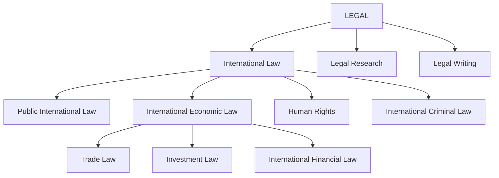

# ⚖️ International Law · Economics · Finance · Languages 
A multidisciplinary knowledge and learning system integrating 
- international law
- international economics law 
- international investment law
- international financial law
- languages

### 🌐 The Nexus of Law, Economy, and Global Discourse
At the core of this digital repository lies a fundamental premise: **modern cross-border challenges cannot be solved through a single lens.**
This system bridges these interconnected pillars to form a comprehensive legal and economic framework:

- **The Regulatory Foundation (International Law & Economic Law):** Serving as the overarching architecture that governs state sovereignty, treaty obligations, and the rules of engagement within global commerce.
    
- **The Commercial Dynamics (International Investment & Financial Law):** Examining how capital moves across borders, how foreign investments are protected through Investor-State Dispute Settlement (ISDS), and how financial compliance and sovereign asset recovery operate in practice.
    
- **The Market Catalyst (International Economics):** Providing the economic rationale and policy context that drive regulatory shifts, trade agreements, and global supply chain adjustments.
    
- **The Global Instrument (Polyglot Languages):** Acting as the linguistic bridge that enables direct access to primary legal sources, comparative jurisprudence, and diplomatic negotiations across major global jurisdictions (English, Spanish, French, Korean, and Bahasa Malaysia).

By synthesizing these disciplines, this hub transforms disparate fields of study into a unified, actionable ecosystem for advanced research, public sector execution, and future academic pursuits.

---
## 🎯 Professional Profile & Living Commitment

### 🌟Multidisciplinary Expertise
International trade and financial law, international economics, corporate finance, MBA fundamentals, and multilingual communication across **English, Spanish, French, Korean, and Bahasa Malaysia**.
### 🌍 Digital-Nomad Professional
A location-independent professional who combines continuous learning, cross-disciplinary research, legal-economic analysis, and strategic consulting through an optimized personal knowledge management system.
### 💻 Digital Knowledge Ecosystem
Designed to work seamlessly across a **MacBook, 11-inch iPad, 13-inch iPad, and iPhone**, enabling research, writing, language learning, knowledge management, and professional work from anywhere.

---
# 📚 Knowledge Hub
## ⚖️ [1. International Law & International Economics](https://thunchanok-law.th-sirisomboon.workers.dev)
- [[international-law]]
- [[international-trade-law|International Trade Law]]
- [[digital-financial-law|Digital Financial Law & Financial Innovation]]
- [[international-economics|International Economics & Trade Policy]]
---
## 🌐[2.Polyglot Hub](https://thunchanok-polyglot.th-sirisomboon.workers.dev)
- English — Academic & Legal Precision
- Español 
- Français 
- 한국어 
- Bahasa Malaysia 
---
## 🎯 3. IELTS Band 9 Preparation
- [[Listening]]
- [[Reading ]]
- [[Writing]]
- [[Speaking]]
---
## 📈 4. Finance & Investment
- [[corporate-finance|Corporate Finance & MBA Fundamentals]]
- [[investment-strategies|Investment Strategies & Digital Assets]]
---
## My Treasure map 

> **Objective:** Build deep, interconnected expertise rather than isolated knowledge.

## About me
[[ME]]
[[Research Interests and Focus Areas]]

**By Thunchanok Sirisomboon**  
